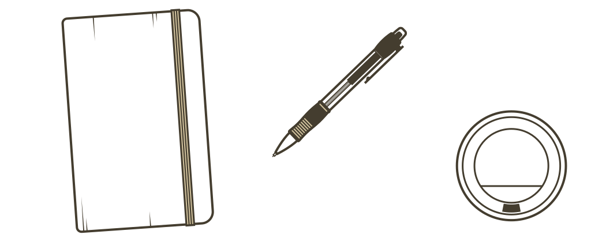

# A little about me...

I got lousy grades at the end of high school and didn't like the university I enrolled back home in Prague. So I made a website that helped me get admitted to an university in Copenhagen and moved to Denmark.

I don't like searching in job banks and filling out long forms. So I made an online interactive CV and sent it out to bunch of agencies around Copenhagen. It landed me an internship and subsequently a job at an agency.

I managed to skip writing a case study for my bachelor project at a business school. I got away with writing a non-businessy paper about Information Design instead. Ohh, and I wrote it using Markdown, Gulp and other Web technologies.

I love doing normal things in an untraditional way. Mostly by devising strategies on how to communicate in a way that has an impact and leaves a lasting impression. I've always been like that and the Web proved to be a life-changing medium for me in this respect. It helped me contemplate my journey through life in a way I saw fit. Now I'm using all that I've learned over the years to help make the Web work for others as well.

